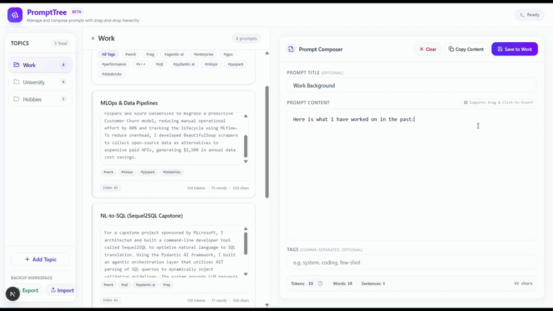

# PromptTree

**Manage and chain modular prompt chunks with a drag-and-drop canvas.**

PromptTree is a Next.js application that helps you compose prompts using reusable context blocks (like bios, system specs, or custom instructions). Instead of copying and pasting the same background info repeatedly into LLM windows, you can store them as local cards and chain them together on a drag-and-drop board.



---

## Problems Solved

*   **External Prompt History**: Save prompt context chunks and reuse them across Gemini, ChatGPT, and Claude. You can chain multiple templates together in the writing area while seeing a live token count, so you don't have to keep retyping background info.
*   **Visual Clutter**: The drag-and-drop snapping grid automatically truncates long text lines (showing only the first and last three words) when you drag a card. This keeps the drop map compact and easy to read even with large prompts.

---

## Key Features

1.  **Full-Screen Composer**: A text canvas that expands to occupy all remaining screen space, giving you a focused environment to write and review prompts.
2.  **Drag-and-Drop Snapping Grid**: Drag a saved card and drop it onto empty line slots in the editor to chain your prompt blocks together.
3.  **Variable Parser**: Automatically parses double curly-brace variables (like `{{user_name}}`) on the fly, creating form fields below the text area to easily inject values.
4.  **Local Backup & Portability**: Export and import your entire prompt library as a JSON file, or clear the database with a single click.

---

## Architecture & System Design

PromptTree runs entirely client-side for zero-latency interactions:

*   **Zustand State Store**: Manages in-memory state changes optimistically. UI actions (like drag reordering or editing topic names) update the interface instantly while writes commit to the database asynchronously.
*   **Dexie.js (IndexedDB)**: Direct database wrapper for high-throughput local storage. Handles offline persistence, relational mappings between topics and prompts, and cascading deletes when a topic is removed.
*   **Asynchronous Event Loop**: Drag operations dispatch custom events (`prompt-drag-start`) that build the dynamic snapping grid layout in the background without blocking the main UI thread.

---

## Future Additions

*   **Companion Extension**: A browser extension that monitors your AI chats (ChatGPT, Gemini, Claude) and prompts you to save repeated context blocks directly to your PromptTree database.

---

## Getting Started

### Prerequisites
*   Node.js 18+
*   npm or yarn

### Installation

1. Clone the repository and navigate into the directory:
   ```bash
   git clone https://github.com/SVijayB/PrompTree.git
   cd PrompTree
   ```

2. Install dependencies:
   ```bash
   npm install
   ```

3. Run the development server:
   ```bash
   npm run dev
   ```

4. Open [http://localhost:3000](http://localhost:3000) to use the app.
